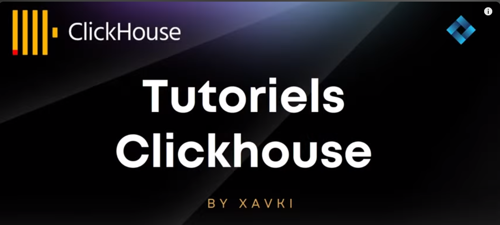

# tuto_clickhouse

https://youtube.com/playlist?list=PLn6POgpklwWrPq8TYJFIo3q2kB9FvJyq1&si=U_u82IkgNe9fkcIJ

- CLICKHOUSE : Introduction
- CLICKHOUSE : OLAP vs OLTP
- CLICKHOUSE : Apache Parquet -> exemple Python 
- CLICKHOUSE local : du SQL dans dans la ligne de commande (S3, fichiers locaux,...)

